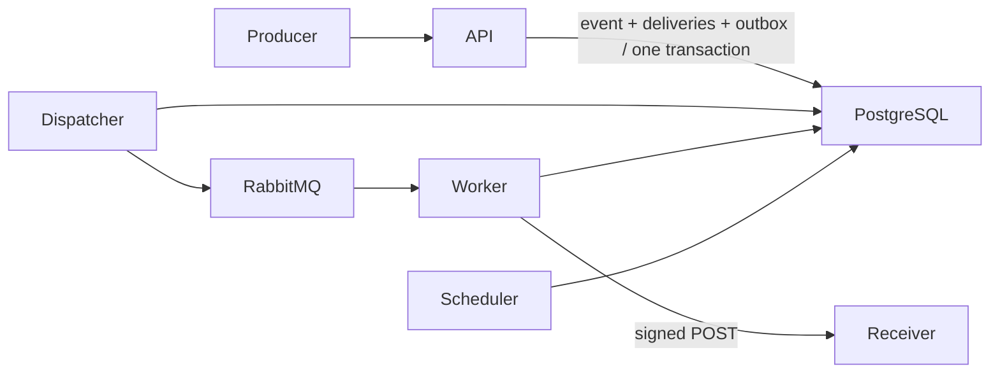
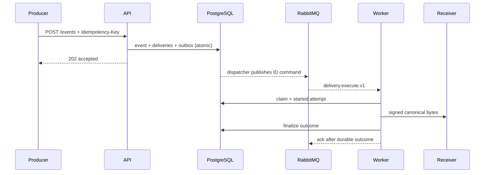

# Webhook Delivery Platform

This standalone SaaS handles reliable callback delivery for asynchronous media processing. Media
pipelines submit tenant-scoped job events; the platform stores the delivery plan durably and sends
signed HTTP callbacks to customer systems without coupling media workers to external endpoints.

## Why This Project Exists

Video transcoding, AI generation, rendering, analysis, and import jobs often run for minutes. Their
workers should be free to finish the job even when a customer's callback endpoint is slow or
unavailable. This service extracts that concern into a dedicated multi-tenant delivery layer with
durable acceptance, bounded retries, attempt evidence, dead-letter handling, and controlled replay.

## Use Cases

- Video transcoding and rendition completion callbacks.
- AI image, video, and audio generation status updates.
- Media moderation, transcription, and content-analysis results.
- Thumbnail, preview, waveform, and proxy generation events.
- Large media import, export, and archive job completion.

## Who It Is For

Media platforms that run asynchronous processing pipelines and need a shared callback service for
multiple customers or products. Receivers must support deduplication, while operators must be able
to trace attempts and replay terminal deliveries without touching the original media job.

## Client Interface

This repository contains the backend service. A separate client application is available in the
[webhook_delivery_platform interface repository](https://github.com/TheReptilianSet/webhook_delivery_platform_client.git)
and provides interfaces for Web, iOS, and Android.

## Example Scenario

A transcoding worker finishes the HLS renditions for a video and submits
`media.processing.completed`. The platform commits the event and callback work together, then calls
the customer's verified endpoint in the background. A temporary receiver outage does not reopen or
delay the media job: delivery follows the retry schedule and eventually moves to `dead_lettered` if
the endpoint stays unavailable. The customer deduplicates by `Webhook-Event-Id`, and an operator can
inspect the attempt history before replaying the terminal delivery.

## Delivery Guarantees

Delivery is at least once; consumers must deduplicate by `Webhook-Event-Id`. A worker crash after a
receiver side effect but before the durable result commit can cause a duplicate request. Ordering is
not guaranteed in v0.1. PostgreSQL is the source of truth; the RabbitMQ command carries identifiers,
not event bodies or secrets.

## When Not to Use It

Do not use this project as a Kafka replacement, workflow engine, synchronous RPC proxy, or
exactly-once ledger. v0.1 does not support private destinations, arbitrary ports, transformations,
custom headers, mTLS, wildcard subscriptions, or multi-region operation. The backend does not embed
or serve the separate client interface.

## Architecture

The repository is a modular monolith with separate API, outbox dispatcher, retry scheduler, and
Celery worker processes built from one image.





## Stack and Trade-offs

Python 3.13, FastAPI, SQLAlchemy async, PostgreSQL, Alembic, Celery/RabbitMQ, HTTPX, AES-GCM,
Argon2id, Prometheus, `uv`, Ruff, mypy, pytest, Docker Compose, and GitHub Actions. In-process rate
limits are adequate only for the single API instance in the local stack; multiple API replicas
require a separately designed distributed limiter.

## Quick Start

Prerequisites: `uv`, Docker, and Docker Compose.

```bash
uv sync --all-groups --frozen
docker compose build
docker compose up -d --wait
uv run python scripts/local_acceptance_flow.py
docker compose down
```

The local acceptance flow sends callbacks only to the exact Compose receiver at
`http://test-receiver:8080`. Never enable this development exception in production.

To inspect the same local topology without publishing PostgreSQL, RabbitMQ, or receiver ports, use:

```bash
docker compose -f compose.yaml -f compose.production-like.yaml config
```

The override is an exposure check, not a production deployment configuration; production still
requires externally supplied TLS database/broker URLs and distinct runtime secrets.

## Local Browser Clients

Development and test environments accept CORS preflight requests from `localhost`, `127.0.0.1`,
and `[::1]` on any port. This covers common local clients such as Vite on `5173` or a media console
on `3000`. `Authorization`, `Content-Type`, `Idempotency-Key`, and `X-Request-Id` are allowed;
`Idempotency-Replayed` and `X-Request-Id` are exposed to browser code.

The browser console text `strict-origin-when-cross-origin` names the active referrer policy; by
itself it is not a request failure. If a local request is blocked, inspect the preceding `OPTIONS`
request and its `Access-Control-Allow-Origin` response. Local-origin matching can be disabled with
`WEBHOOK_PLATFORM_ALLOW_LOCAL_BROWSER_ORIGINS=false`. Production refuses to start while that local
exception is enabled; deployers must provide exact HTTPS origins through
`WEBHOOK_PLATFORM_CORS_ALLOW_ORIGINS`.

Use `http://localhost:8000` as the API address in a local browser, not `0.0.0.0`. Browser clients
authenticate with a Bearer token and should not enable cookie credentials. If the local UI is served
over HTTPS, route API calls through its development proxy or serve the API over HTTPS as well so a
mixed-content block is not mistaken for a CORS failure.

## API and Signature Verification

The JSON API is under `/api/v1`; interactive OpenAPI is at `/docs`. Register, create an organization
API key, create and verify an endpoint, then submit events using that producer key and an
`Idempotency-Key`.

Delivery uses the exact stored canonical request bytes. The signature input is:

```text
timestamp + "." + event_id + "." + delivery_id + "." + raw_body
```

`Webhook-Signature` is `v1=` followed by lowercase HMAC-SHA256 hex.

## Security Model

Production endpoints require HTTPS on port 443, no redirects, and public A/AAAA results both at
registration and immediately before delivery. Secrets are displayed once. API keys are stored as a
peppered HMAC digest; endpoint secrets and response previews use AES-256-GCM with resource-bound
AAD. Application logs and metrics must never include credentials, signatures, raw payloads, previews,
or tenant/resource identifiers as metric labels.

DNS validation reduces SSRF exposure but is not a substitute for deployment-level egress controls.

## Retry, DLQ, and Replay

Network/TLS/timeouts, 408, 425, 429, and 5xx are retried. Redirects and other 4xx are terminal.
Delays are 30 seconds, 2 minutes, 10 minutes, 1 hour, and 6 hours with up to 20% jitter; at most six
attempts occur. `dead_lettered` in PostgreSQL is canonical. Manual replay creates a linked delivery
without modifying the original history or changing the event ID.

## Limits and Retention

Event bodies are limited to 256 KiB and JSON depth 20. An organization may have 100 endpoints and
10,000 non-terminal deliveries; one endpoint permits at most three concurrent calls. Response
previews retain at most 4 KiB for seven days; metadata retains for 30 days and audit data for 90 days.

## Testing and Verification

Canonical commands and honest results are recorded in [verification](docs/verification/README.md).
Operational response procedures are under [runbooks](docs/runbooks/). The active
[specification](docs/specifications/PROJECT_SPECIFICATION.md) and accepted architecture decisions
remain the sources of truth.

No SLO, compliance posture, or production readiness is claimed without measured evidence.

## Roadmap Triggers

Redis, Kafka, service extraction, partitioning, Kubernetes, and private destinations are considered
only when the thresholds in the active specification are met and documented in an ADR.

## License and Security Reporting

The source is provided under the [MIT License](LICENSE) for private, commercial, modified, and
self-hosted use. The current distribution is source-first and carries no SLA; a future managed SaaS
would use separate service and support terms without changing the MIT rights granted for this code.
See [Community and Distribution](docs/COMMUNITY.md) for the support, contribution, and delivery
model.

Do not open a public issue containing credentials, payloads, endpoint URLs, or personal data. Report
security concerns privately to the repository owner or through the repository host's private
security-reporting feature.
